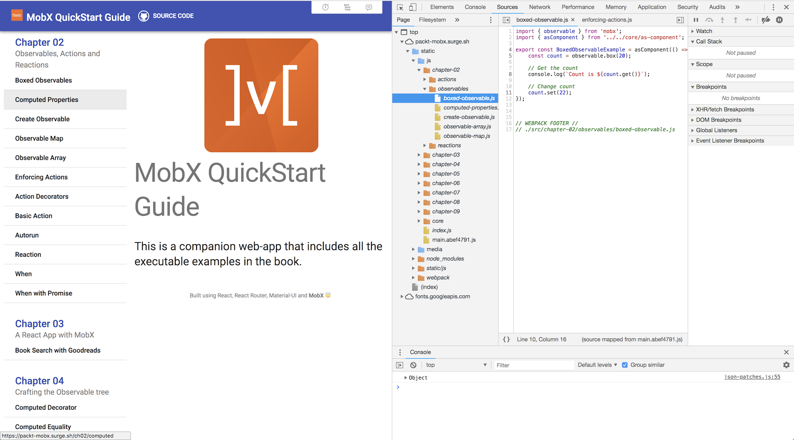

## $5 Tech Unlocked 2021!
[Buy and download this Book for only $5 on PacktPub.com](https://www.packtpub.com/product/mobx-quick-start-guide/9781789344837)
-----
*If you have read this book, please leave a review on [Amazon.com](https://www.amazon.com/gp/product/1789344832).     Potential readers can then use your unbiased opinion to help them make purchase decisions. Thank you. The $5 campaign         runs from __December 15th 2020__ to __January 13th 2021.__*

# MobX Quick Start Guide

<a href="https://www.packtpub.com/web-development/mobx-quick-start-guide?utm_source=github&utm_medium=repository&utm_campaign=9781789344837 "></a>

This is the code repository for [MobX Quick Start Guide](https://www.packtpub.com/web-development/mobx-quick-start-guide?utm_source=github&utm_medium=repository&utm_campaign=9781789344837), published by Packt.

**Apply functional Reactive programming for simple and scalable state management with MobX**

## What is this book about?

MobX is a simple and highly scalable state management library in JavaScript. Its abstractions can help you manage state in small to extremely large applications. However, if you are just starting out, it is essential to have a guide that can help you take the first steps. This book aims to be that guide that will equip you with the skills needed to use MobX and effectively handle the state management aspects of your application.

This book covers the following exciting features:

-   Explore the fundamental concepts of MobX, such as observables, actions, and reactions
-   Use observables to track state and react to its changes with validations and visual feedback (via React Components)
-   Create a MobX observable from different data types
-   Define form data as an observable state and tackle sync and async form validations
-   Use the special APIs to directly manipulate observables, tracking its changes, and discovering the reasons behind a change

If you feel this book is for you, get your [copy](https://www.amazon.com/dp/1-789-34483-2) today!

<a href="https://www.packtpub.com/?utm_source=github&utm_medium=banner&utm_campaign=GitHubBanner"></a>

## Instructions and Navigations

All of the code is organized into folders. For example, `Chapter02`. There are no codes for Chapter 1.

The code is formatted like so:

```
connect(mapStateToProps, mapDispatchToProps, mergeProps, options)(Component)
```

**Following is what you need for this book:**
This book is for web developers who want to implement easy and scalable state management for their apps. Knowledge of HTML, CSS, and JavaScript is assumed

With the following software and hardware list you can run all code files present in the book (Chapter 02-09).

### Software and Hardware List

| Chapter | Software required                                                                                         | OS required                        |
| ------- | --------------------------------------------------------------------------------------------------------- | ---------------------------------- |
| All     | Visual Studio Code or any other preferred editor. Modern Web Browser like Chrome, Firefox, Edge or Safari | Windows, Mac OS X, and Linux (Any) |

We also provide a PDF file that has color images of the screenshots/diagrams used in this book. [Click here to download it](https://www.packtpub.com/sites/default/files/downloads/MobXQuickStartGuide_ColorImages.pdf).

## Code in Action

Click on the following link to see the Code in Action:

[http://bit.ly/2NEww85](http://bit.ly/2NEww85)

### Related products

-   Vuex Quick Start Guide [[Packt]](https://www.packtpub.com/web-development/vuex-quick-start-guide?utm_source=github&utm_medium=repository&utm_campaign=9781788999939) [[Amazon]](https://www.amazon.com/dp/1-788-99993-2)

-   Learning Redux [[Packt]](https://www.packtpub.com/web-development/learning-redux?utm_source=github&utm_medium=repository&utm_campaign=9781786462398) [[Amazon]](https://www.amazon.com/dp/1-786-46239-7)

## Get to Know the Author

**Pavan Podila**
has been building frontend applications since 2001 and has used a variety of tools, technologies, and platforms, from Java Swing, WPF with .Net/C#, Cocoa on macOS and iOS, to the web platform with frameworks like React and Angular. He has been working with React since 2013 and MobX since 2016. He is a colead of the Interactive Practice at Publicis.Sapient, where he builds large financial apps for web and mobile platforms.

Earlier, he was a Microsoft MVP for client application development (2008-2011), a published author of [WPF Control
Development Unleashed (Addison-Wesley)](https://www.amazon.com/WPF-Control-Development-Unleashed-Experiences/dp/0672330334). He created [QuickLens](http://quicklensapp.com), a
Mac App for UI designers/developers, and authored several articles and video courses on Tuts+.

Pavan is a [Google Developer Expert (GDE)](https://developers.google.com/experts/people/pavan-podila) for web
technologies and currently authors courses on [The UI Dev](https://theuidev.com). He is a
regular speaker at meetups, conferences, and workshops. When time permits, you can find him sketching on iPad or playing Ping-Pong

**Michel Weststrate**
is tech lead and open source evangelist at Mendix. He has been active as both a frontend and backend developer in different stacks. An occasional speaker at software conferences, he has authored video courses on egghead.

Intrigued by several (transparent) reactive programming libraries, he researched and worked on making the ReactJS framework more reactive while addressing predictability and maintainability constraints in other solutions. This led to mobservable (nowadays MobX), which was quickly adopted at Mendix.

He's very active in the open source software community, and he authored MobX, Immer, and several small libraries, and
coauthored MobX-State-Tree.

## See it live

<a href="https://packt-mobx.surge.sh"></a>

Go to [https://packt-mobx.surge.sh](https://packt-mobx.surge.sh) to see the app running live. Source maps have been included so you can browse
the source for the examples in DevTools.

## How to run the examples

-   Install Node
-   Clone this repo using git to a local folder
-   Run `npm install` on the top-level folder
-   Run `npm start` to launch the app on [http://localhost:3000](http://localhost:3000)

### Goodreads API Key

-   Needed to run the example for **Chapter 03: A React App with MobX**.
-   [Register for an API Key](https://www.goodreads.com/api/keys).
-   Create a file called `.env.local` at the top level, as a peer of `.env`
-   Put the following line with your API Key:

```text
REACT_APP_GOODREADS_APIKEY = <API-Key>
```
